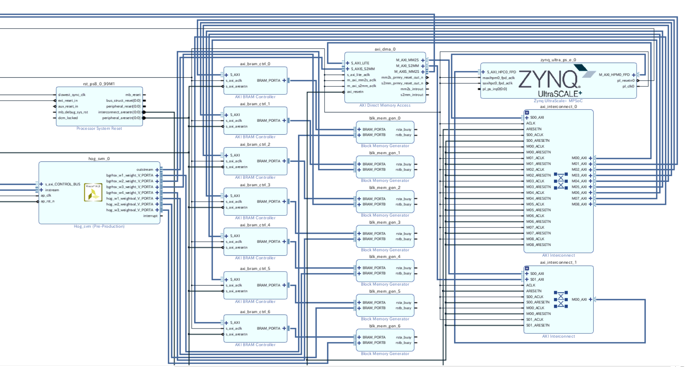

# ImageDetectionHW2  

HOG/BGRHSV + SVM FPGA Implementation of Object Detection  
This system detects red traffic signal from USB webcam captured image in real time.  
System runs on Debian/Ubuntu OS on Ultra96(rev1) development board. HW Object Detection Accelerator is implemented in FPGA.  
HW Accelerator is developed by HLS, which calculates the probability of being a red traffic signal for 891(32pix\*64pix) regions in (240pix\*320pix) BGR image.
Detail of Algorithm is described in `hls/README.md`

- HLS IP Latency: min:153838 max:196936 (not fully pipelined)  
- Achieved FPS: pver 142fps (including DMA data transmission time, more than 200 times faster than SW)  

## Application Example  
This system is equipped with the miniature robot car.  
Youtube Link:  
[](https://www.youtube.com/watch?v=qpykwwZaatw)  
[](https://www.youtube.com/watch?v=zwXOoCu3Y1Q)  

# Usage  
### Create SD Card for Ultra96  
First create SD Card for Ultra96 following this instruction: [ZynqMP-FPGA-Linux](https://github.com/ikwzm/ZynqMP-FPGA-Linux).  
You must install udmabuf device driver following the [instruction](https://github.com/ikwzm/ZynqMP-FPGA-Linux/blob/master/doc/build/device-drivers.md).    
Japanese instruction is [here](https://qiita.com/ikwzm/items/975ab6997905700dd2e0).  
### Install OpenCV  
After you finish setup of Debian OS on Ultra96, install OpenCV from source code like [this](https://gist.github.com/okanon/c09669f3ff3351c864742bc2754b01ea). In my environment, I use OpenCV-3.4.1 version. It takes a while.  
### Copy files to SD Card  
Copy `overlay/` and `app/` directory of this repository to rootfs partition of your SD card.  
Steps after this should be done on Ultra96 board.  
### FPGA Configuration and Device Tree Overlay  
Connect Ultra96 board by USB-serial port or ssh connection.
```
fpga@debian-fpga$ sudo -s
root@debian-fpga$ cd ~/overlay
root@debian-fpga$ cp fpga.bin /lib/firmware/
root@debian-fpga:~/overlay# ./init.sh 
hog_svm.dtb: Warning (unit_address_vs_reg): /fragment@0/__overlay__/hog_svm_0: node has a reg or ranges property, but no unit name
dma0.dtb: Warning (unit_address_vs_reg): /fragment@0/__overlay__/axi_dma_0: node has a reg or ranges property, but no unit name
```
FPGA configuration is done by this command.  
### Run demo application on Ultra96.  
#### 1. detect traffic signal from one frame image.  
```
root@debian-fpga:~# cd ~/app/hog_svm_test
root@debian-fpga:~/app/hog_svm_test# sh compile.sh
root@debian-fpga:~/app/hog_svm_test# ./a.out
1.6268558502 0.8357384801
2.9449763298 0.9500254989
2.1004710197 0.8909489512
elapsed:6.0000000000[milisec]
fps:166.6666666667[fps]
```  

#### 2. detect traffic signal from captured image in real-time.  
First plug USB webcam to Ultra96.  
```
root@debian-fpga:~# cd ~/app/realtime_webcam
root@debian-fpga:~/app/realtime_webcam# sh compile.sh
root@debian-fpga:~/app/realtime_webcam# ./a.out
```

## Re-train and update trained parameter.  
In this project, trained parameter of SVM is used in HLS IP and is saved in BRAM, and we can update this value from SW.  
### Run re-train in `python/train.py`  
The detail instruction is written in `python/README.md` In short  

# file description  
### data  
Training data. This files are used `python/vdtools.py`  
### python  
python and scikit-learn library are used to train, verify accuracy and export trained weight to cpp header file.  
detail description is in `python/README.md`  
### hls  
HOG + SVM Vivado HLS project.
The detail description of algorithm used is in `hls/README.md`
### vivado  
You can create project by running `create_project.tcl` from Vivado 2018.2 
  
### cpp  
Some SW-level applications to verify porting from python to C++.  
detail description is in `cpp/README.md`  
### overlay  
FPGA bistream is configured and IPs are registered as `generic-uio` device by Linux Device Tree Overlay function.  
This directory contains bitstream, device tree file, and initialize shell script.  
### app  
These application only works on Ultra96, containing interface layer to call FPGA IP.
### util  
Utility program.

## reference  
[Hua Luo, Jian & Hong Lin, Chang. (2018). Pure FPGA Implementation of an HOG Based Real-Time Pedestrian Detection System. Sensors. 18. 1174. 10.3390/s18041174.](https://www.ncbi.nlm.nih.gov/pubmed/29649146)  


